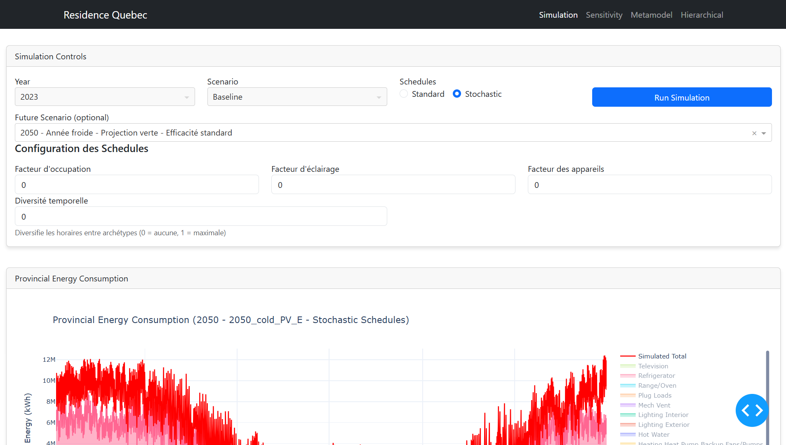

# Guide d'utilisation - Dashboard

Le dashboard interactif du projet UBEM Résidentiel Québec offre une interface graphique conviviale pour lancer des simulations, visualiser les résultats et suivre les processus de calibration.

## Dashbord technique



*Interface du dashboard montrant la configuration de simulation et la visualisation des résultats*

## Lancement du dashboard

Pour lancer le dashboard, exécutez la commande suivante:

```bash
python -m src.main dashboard
```

Accédez ensuite à l'URL indiquée dans la console (généralement http://127.0.0.1:8050/).

## Organisation de l'interface

Le dashboard est organisé en plusieurs onglets:

### 1. Accueil

Page d'accueil avec informations générales sur le projet et statut des composants.

### 2. Simulation

Permet de configurer et lancer des simulations:

- Sélection de l'année de simulation
- Choix entre horaires standards ou stochastiques
- Sélection d'un scénario futur
- Configuration des options avancées
- Suivi en temps réel de l'avancement des simulations

### 3. Résultats

Visualisation des résultats de simulation:

- Graphiques de consommation horaire
- Comparaison avec les données mesurées
- Métriques de performance (RMSE, MAE, MAPE)
- Exportation des données

### 4. Calibration

Interface pour configurer et lancer les calibrations:

- Analyse de sensibilité
- Calibration par métamodélisation
- Calibration hiérarchique
- Apprentissage par transfert
- Visualisation des résultats de calibration

### 5. Profils

Visualisation des profils de charge:

- Profils journaliers par saison
- Profils hebdomadaires
- Courbes de charge par usage
- Pointes saisonnières

### 6. Schedules

Visualisation des schedules stochastiques générés:

- Profils d'occupation
- Profils d'utilisation d'éclairage
- Profils d'utilisation d'appareils électroménagers
- Diversité temporelle entre archétypes

## Fonctionnalités principales

### Visualisation interactive

- Graphiques zoomables et interactifs
- Sélection de périodes spécifiques
- Personnalisation des affichages
- Export des graphiques en format PNG

### Code couleur

Le dashboard utilise un code couleur cohérent:

- **Bleu**: Données mesurées
- **Rouge**: Données simulées
- **Autres couleurs**: Usages finaux et métriques additionnelles

### Suivi des processus

Le dashboard permet de suivre en temps réel:

- L'état des simulations en cours
- L'avancement des calibrations
- Les résultats intermédiaires des processus longs

### Configuration des paramètres

Le dashboard permet de configurer:

- Les paramètres de simulation
- Les options de calibration
- Les affichages de résultats
- Les exportations de données

## Exemples d'utilisation

### Comparer des scénarios

1. Lancez une simulation pour un scénario de référence
2. Visualisez les résultats dans l'onglet "Résultats"
3. Lancez une simulation pour un scénario futur
4. Comparez les résultats en utilisant l'option "Comparer les scénarios"

### Calibrer et visualiser les résultats

1. Dans l'onglet "Calibration", configurez les paramètres
2. Lancez la calibration
3. Suivez l'avancement dans l'interface
4. Une fois terminé, visualisez les paramètres calibrés
5. Lancez une simulation avec ces paramètres
6. Analysez l'amélioration des résultats 